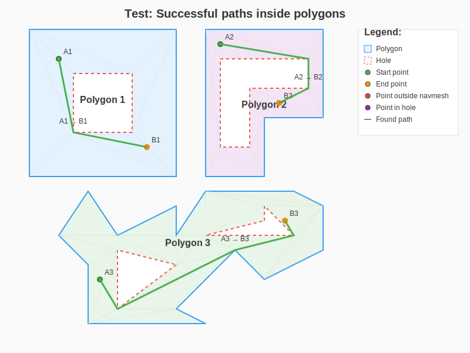
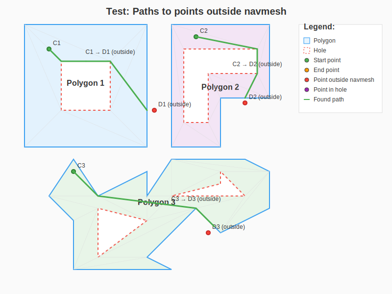

# Path Finding 2D

Fast library for pathfinding in 2D space using triangulated navmesh based on [poly-math-2d](https://www.npmjs.com/package/poly-math-2d).

## Features

- ✅ **Fast pathfinding** through triangulated polygons using A* algorithm
- ✅ **Complex polygon support** including polygons with holes
- ✅ **Path optimization** using string-pulling algorithm
- ✅ **TypeScript support** with full type definitions
- ✅ **Minimal dependencies** - only poly-math-2d
- ✅ **High performance** - optimized for speed

## Installation

```bash
npm install path-finding-2d
```

## Demonstration
You can find the visualization script in the project repository: [https://github.com/andrewNicholson-bbi1911/path-finding-2d](https://github.com/andrewNicholson-bbi1911/path-finding-2d)

### Successful Paths Inside Polygons


### Paths to Points Outside Navmesh


### Working with Polygon Holes


## Quick Start

```typescript
import { Point, Polygon, PolygonMap } from 'poly-math-2d';
import { NavMesh2d } from 'path-finding-2d';

// Create points for polygon with a hole (as in visualization example)
const outerPoints = [
    new Point(50, 50),
    new Point(300, 50),
    new Point(300, 300),
    new Point(50, 300)
];

const holePoints = [
    new Point(125, 125),
    new Point(225, 125),
    new Point(225, 225),
    new Point(125, 225)
];

// Create a polygon with a hole
const hole = new Polygon(holePoints);
const polygonWithHole = new Polygon(outerPoints, [hole]);

// Create polygon map and navmesh
const polygonMap = new PolygonMap([polygonWithHole]);
const navMesh = new NavMesh2d(polygonMap);

// Find path between two points
const start = new Point(100, 100);
const end = new Point(250, 250);
const path = navMesh.findPath(start, end);
console.log(path); // Array of path points
```

## API

### NavMesh2d

Main class for working with navmesh.

#### Constructor

```typescript
constructor(polygonMap: PolygonMap)
```

Creates a navmesh from a polygon map. PolygonMap should contain polygons that are already triangulated by the poly-math-2d library.

#### Methods

##### `isPointInNavMesh(point: Point): boolean`

Checks if a point is inside the navmesh.

**Parameters:**
- `point` - point to check

**Returns:** `true` if the point is inside the navmesh, otherwise `false`

##### `findPath(a: Point, b: Point): Point[]`

Finds a path from point A to point B.

**Parameters:**
- `a` - start point
- `b` - end point

**Returns:** Array of points representing the path. Empty array if no path is found.

**Behavior details:**
- If point A is not in the navmesh, returns an empty array
- If point B is not in the navmesh or in hole, finds path to the closest point in the same polygon where A is located
- If A and B are in the same triangle, returns a direct path
- Path is optimized to remove unnecessary points

## Algorithm

The library uses the following approach for pathfinding:

1. **Triangulation:** Polygons are automatically triangulated by poly-math-2d library
2. **Neighborhood Graph:** Triangles are connected through shared edges (connections in TPolygon)
3. **A-star Search:** Uses A* algorithm to find optimal path through triangles
4. **String Pulling Optimization:** Applies advanced string-pulling algorithm to find shortest path through portal edges between triangles
5. **Portal System:** Uses shared triangle edges as "portals" for optimal traversal
6. **Intelligent Optimization:** Automatically cuts corners and finds the most efficient route within the navmesh

## Performance

The library is optimized for maximum speed:

- Uses fast distance calculation algorithms (`getDistanceQuick`, `getDistanceSquared`)
- Pre-calculated triangle centers
- Barycentric coordinates for point-in-triangle checks
- Efficient data structure for A* search
- **Advanced String Pulling:** Finds optimal paths through portal edges
- **Intelligent Optimization:** Automatically skips intermediate points when direct path is possible
- **Geometric Optimization:** Uses projections and vector calculations for precise positioning

## Requirements

- [poly-math-2d >= 0.2.0](https://www.npmjs.com/package/poly-math-2d)

## License

MIT

## Dependencies

- [poly-math-2d](https://www.npmjs.com/package/poly-math-2d) - Library for working with 2D polygons, triangulation, and boolean operations